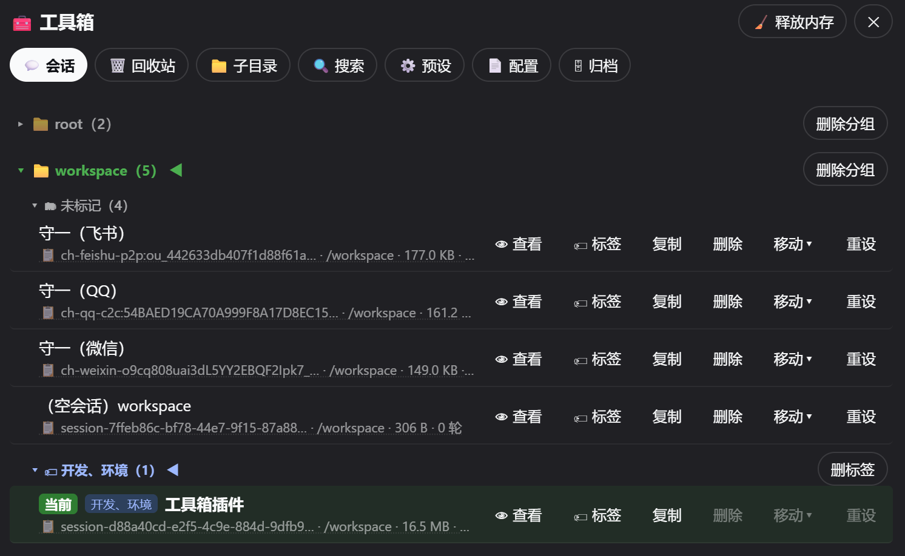
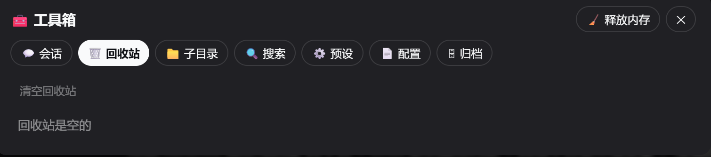
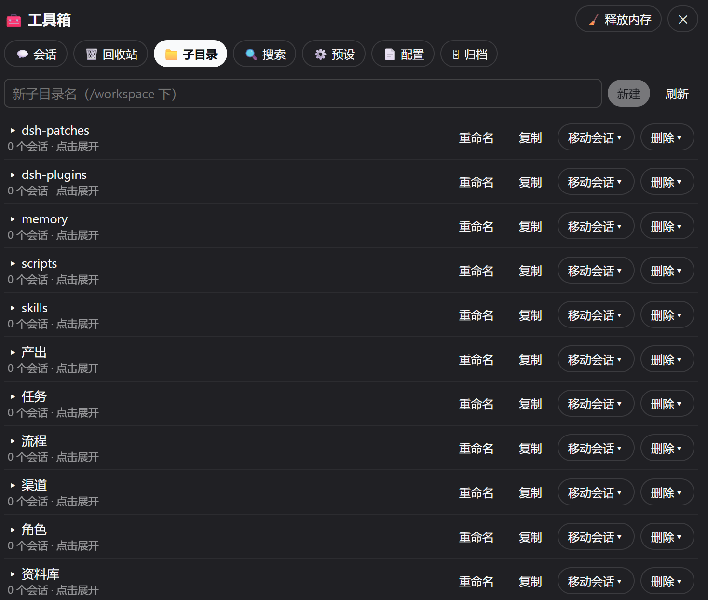
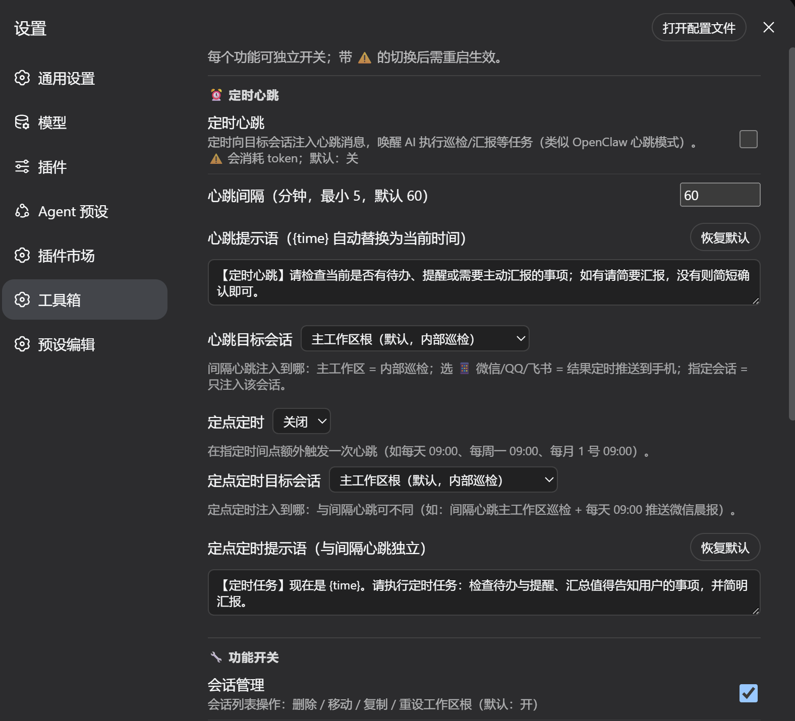
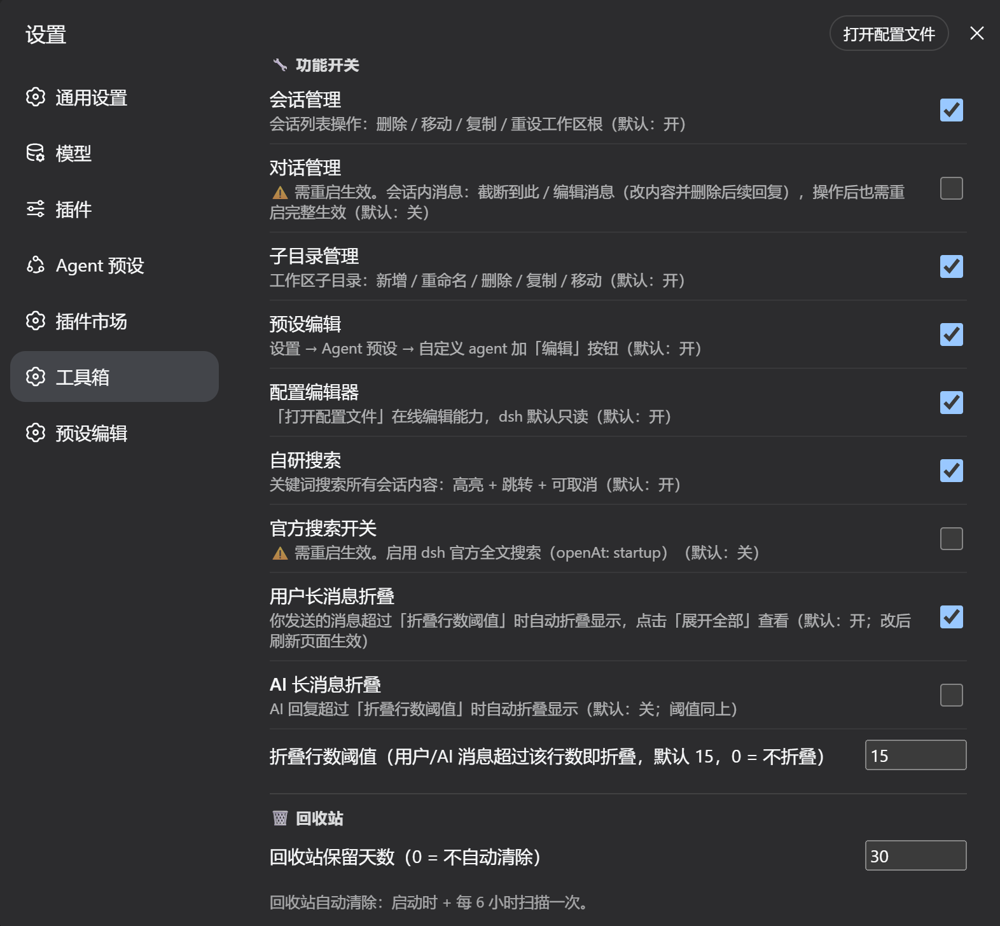

# dsh-toolbox

[English](README.en.md) | [简体中文](README.md)


> A toolbox plugin for dsh (DeepSeek Harness): session management / trash bin / subdirectory management / full-text search / preset editing / config editing / archive management.

## ✨ Features

- **💬 Session Management**: delete (to trash), duplicate (official fork with `-copyN` naming), move (between workspaces), reset workspace root, tag grouping (click-to-select editor for existing tags to avoid typos; tag management: delete/rename, renaming merges duplicates), view session content (read-only), conversation management (truncate/edit, disabled by default), empty sessions auto-labeled as `(empty session) workspace-name`
- **⏰ Scheduled Heartbeat**: wake the AI on a schedule to run checkups/reports (OpenClaw-style heartbeat) — two schedulers: **interval heartbeat** (every N minutes) and **fixed-time schedule** (daily at HH:mm / weekly on a weekday / monthly on a date), each with its own prompt and target; targets can be the **main workspace root (internal checkup), any session, or 📱 WeChat / QQ / Feishu IM channels** (wakes the channel bot and pushes the AI reply back to your phone). The scheduler runs in the **dsh backend process** — **no need to keep the web page open**; the container (dsh service) running is enough. Channel push is an **optional integration**: it depends on the `dsh-channels-push` service provided by our in-house channel bridge plugin dsh-im-bridge (see "IM Channel Push (optional)" below); without it the heartbeat automatically falls back to the main workspace root
- **📃 Long-message Collapse**: messages longer than the threshold (15 lines by default, configurable) auto-collapse with an "expand all" button; on by default for user messages, off for AI replies (pure render-layer enhancement, no data modification)
- **🗑️ Trash Bin**: deleted sessions/subdirectories go to trash (30-day retention by default, configurable); restore / purge / preview deleted session content
- **📁 Subdirectory Management**: create / rename / delete / duplicate directories under a workspace, batch-assign sessions
- **🔍 Full-text Search**: search across all sessions (highlight + jump + cancellable; frame-by-frame streaming decompression for low memory; 60s cache per keyword)
- **⚙️ Preset Editing**: edit Agent preset files online
- **📄 Config Editing**: edit dsh config file online (YAML validation + atomic write)
- **🗄 Archive Management**: view / restore / delete officially archived sessions
- **🧹 Release Memory**: clear plugin caches and attempt GC (full release still requires a container restart)

## 📸 Screenshots

**Session Management** (delete / duplicate / move / reset / tags / view / empty-session labeling):



**Trash Bin** (deleted sessions go to trash; restore / purge / preview):



**Subdirectory Management** (create / rename / delete / duplicate directories under a workspace):



**Settings** (per-feature toggles + scheduled heartbeat / collapse threshold etc.):





## Requirements

- **dsh** runtime (loaded as a dsh plugin; the frontend relies on `react`, `@deepseek-ai/dsh-client-ui-primitives`, etc., injected by the dsh web runtime)
- **Node.js ≥ 22.13** (session files are decompressed via the zstd support in `node:zlib`)
- **Platform**: cross-platform (Node built-in APIs only, no shell dependency). Default paths follow the Linux convention (`/home/dsh`, `/workspace`); on **Windows / macOS, set the `DSH_HOME` and `DSH_CHANNELS_CWD` environment variables** to your actual directories (see "Environment Variables" below)

## Installation

### Option 1: dsh CLI (recommended)

```bash
# From a GitHub repository (auto-clone + install deps)
dsh plugin --profile web add github:AbcdefgXW/dsh-toolbox

# Or from npm if published
dsh plugin --profile web add dsh-toolbox
```

If it is not auto-registered, add to `cordis.patch.yml` in the profile:

```yaml
- insert:
    - id: dsh-toolbox
      name: dsh-toolbox
```

### Option 2: Manual

```bash
git clone https://github.com/AbcdefgXW/dsh-toolbox.git
cd dsh-toolbox
npm install --omit=dev
```

Place the plugin directory on the dsh plugin load path (e.g. `$DSH_HOME/plugins/` or a compose mount), register it as above, then restart `dsh web`.

> `@deepseek-ai/*` packages are shipped with the dsh runtime; their versions track the dsh release. `js-yaml` is a plugin-level dependency (used for config-editing validation).

## Usage

After restarting `dsh web`, hard-refresh the browser (Ctrl+Shift+R) and click the **🧰 Toolbox** button at the bottom-left (shown as a 🧰 icon on narrow mobile screens). Additional toggles live under **Settings → Toolbox**.

## Environment Variables

| Variable | Purpose | Default |
|---|---|---|
| `DSH_HOME` | dsh data directory (sessions/config/caches) | `/home/dsh` |
| `DSH_CHANNELS_CWD` | current workspace root (session cwd base) | `/workspace` |

Defaults apply when unset; all other paths are derived from the plugin's own directory (`import.meta.url`) — no hardcoded paths.

## Data & Safety

- **Runtime data** lives in the plugin `state/` directory (settings, trash, backups, tags) — excluded from the repo via `.gitignore`
- The plugin reads/writes: `$DSH_HOME/sessions/` (session files, multi-frame zstd), `$DSH_HOME/storages/workspace.json` (workspace registry), and the dsh config file (only when using the config editor)
- **Delete = move to trash** (30-day retention by default, restorable) — never a physical delete
- **IM channel push notes**: when scheduled heartbeat pushes to IM channels, WeChat uses a simulated web protocol (ilinkai) — **frequent proactive messaging carries account risk-control risk**; keep the interval ≥ 15 minutes, keep prompt content normal, and avoid bursts of pushes. QQ Open Platform proactive messages require applying for the **"proactive message permission"** (pushes fail silently without it). Feishu uses the official API — compliant and safe.

## IM Channel Push (optional)

The "📱 WeChat / QQ / Feishu" targets of scheduled heartbeat are an **optional integration**: dsh-toolbox calls the `dsh-channels-push` cordis service to "wake the channel bot → push the AI reply back to the IM".

- **dsh-im-bridge** is our in-house channel bridge plugin (WeChat ilinkai / QQ Open Platform / Feishu Open Platform); it is **not distributed with this repository** — install it separately ([dsh-im-bridge](https://github.com/AbcdefgXW/dsh-im-bridge))
- Without that service: channel targets are unavailable (a "channel push service unavailable" note is shown), and heartbeat to the main workspace root / any session is completely unaffected
- A third-party channel plugin exposing the same service name can also be integrated (currently an implementation convention, not a public adapter spec)
- **Conversation management (truncate/edit)**: modifies session files and requires a container restart to take full effect; disabled by default, enable it explicitly in settings

## Development

- `index.js` backend (cordis Service + typert remote, method name = endpoint name); `client.js` frontend (no build pipeline, loaded via `window.__ModuleLoader__`)
- Adding an endpoint requires three synchronized edits: backend method + backend `invocation` registration + frontend `DESCRIPTORS`
- Rewriting session files must use the official multi-frame format (`lib/zstd.js compressSessionText`: a header frame with exactly one line + event frames of 500 lines each); a single-frame compression breaks the dsh loader

## License

MIT — see [LICENSE](LICENSE)
